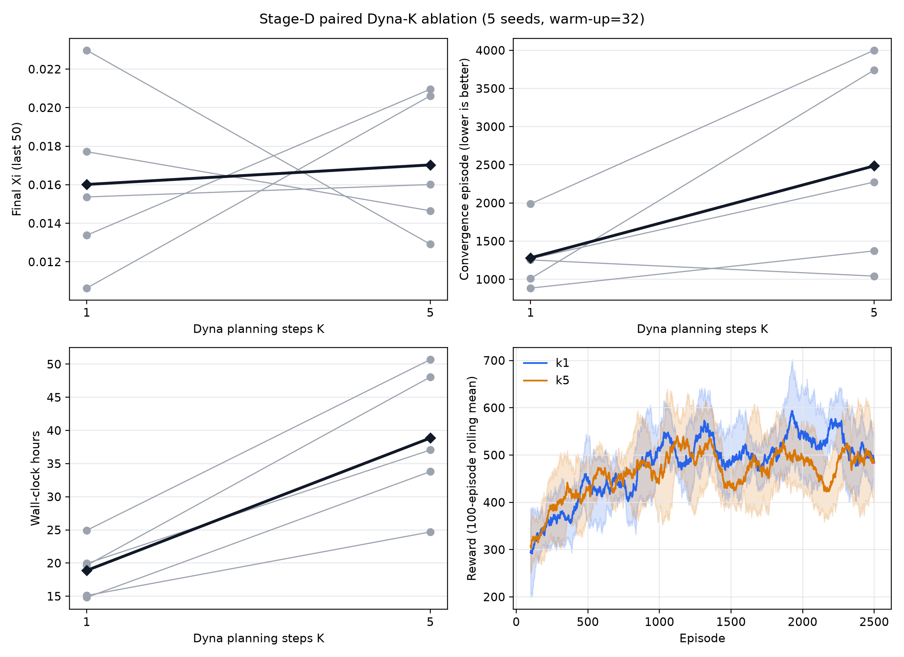
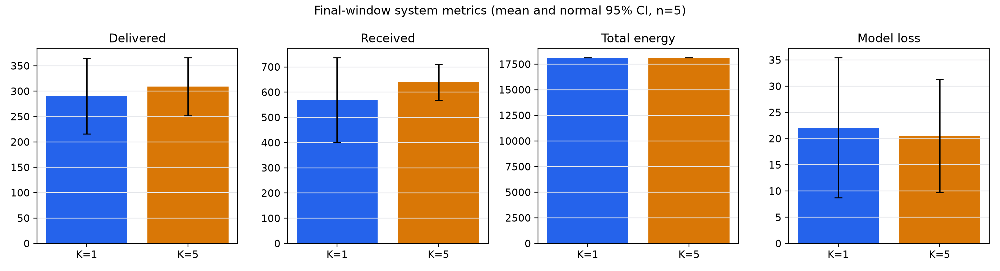

# 阶段 D：Dyna-K 正式消融报告

## 技术结论

在 `paper_xi`、warm-up=32、Case 1 和 5 个配对 seeds 下，**K=5 没有提供可复现的
最终性能或早期学习收益，却使平均墙钟时间增加 105.7%，并使回顾性 90% 峰值收敛点
平均推迟 93.9%**。本阶段建议将 **K=1** 固定为后续 warm-up、Case 2 和 Sionna
验证的默认 Dyna 配置。

K=5 的最终 \(\Xi\) 均值比 K=1 高 6.3%，但配对差异方向不一致，两侧精确置换
检验 `p=0.875`，配对 bootstrap 95% CI 跨 0。该结果只能表述为描述性差异，不能
声称 K=5 提高最终系统能效。

上图中的灰线表示相同 seed 的配对变化，黑色菱形线表示 5-seed 均值；学习曲线仅
展示所有运行共同覆盖的前 2500 轮，并使用 100 轮滚动均值及跨 seed 正态近似 95% CI。

## K=5 的小幅末值优势不足以抵消训练成本

| 指标 | K=1（均值 ± SD） | K=5（均值 ± SD） | K5 相对变化 | 配对两侧精确 p |
|---|---:|---:|---:|---:|
| 最终 reward（末 50 轮） | 480.09 ± 140.36 | 510.64 ± 108.33 | +6.36% | 0.875 |
| 最终 \(\Xi\)（末 50 轮） | 0.01602 ± 0.00468 | 0.01703 ± 0.00360 | +6.33% | 0.875 |
| 前 500 轮归一化 reward AUC | 366.37 ± 47.40 | 379.49 ± 55.78 | +3.58% | 0.5625 |
| 前 1000 轮归一化 reward AUC | 411.57 ± 46.47 | 419.99 ± 55.27 | +2.05% | 0.750 |
| 90% 峰值收敛轮数 | 1281.8 ± 427.7 | 2486.0 ± 1345.5 | +93.95%（更慢） | 0.125 |
| 实际训练轮数 | 3578.2 ± 812.9 | 4437.8 ± 1315.3 | +24.02% | 0.125 |
| 墙钟时间（小时） | 18.89 ± 4.16 | 38.86 ± 10.66 | +105.71% | 0.0625 |
| 世界模型损失（末 50 个有效值） | 22.08 ± 15.26 | 20.51 ± 12.31 | −7.14% | 0.875 |

三个预设主指标（最终 \(\Xi\)、收敛轮数、墙钟时间）经 Holm 两侧校正后的 p 值
分别为 0.875、0.25 和 0.1875，均未达到 `α=0.05`。5 seeds 的两侧精确符号翻转
检验最小可达 p 值为 0.0625，因此不能把墙钟成本差异写成“两侧显著”；但 K=5 在
全部 5 个 seeds 上耗时更长，平均配对增加 19.97 小时，配对 bootstrap 95% CI 为
[14.33, 25.62] 小时，方向和量级均具有决策意义。

## 系统指标没有显示 K=5 的稳定质量改善

末 50 轮中，K=5 的平均 RBS 交付量为 308.83，K=1 为 290.35；平均接收量分别为
639.05 和 568.98。与此同时，K=5 的平均转发/接收比为 48.29%，低于 K=1 的
52.19%，说明更高接收量没有稳定转化为更高转发效率。两种设置的末窗总能耗几乎相同
（18133.09 vs 18124.33），模型损失差异也不稳定。

末 50 轮两个配置的碰撞事件均为 0，但全程并非零碰撞：K=1 和 K=5 的平均每 episode
碰撞事件率分别为 0.00345 和 0.00873。该差异的两侧精确 p=0.375，不能据此声称
K=5 更不安全；论文仍应报告全程碰撞口径，不能只报告末窗。

## 数据、定义与实验范围

- 原始结果：服务器
  `/mnt/UAV/results/dyna_ablation/dyna_ablation_20260803_092911.json`；
- 原始文件 SHA-256：
  `66152151c7b7fb25904fcc0e973820a0f750095a046bda4ad7fbcf8d2c754c04`；
- 组合：K∈{1,5}、warm-up=32、Case 1、`paper_xi`；
- seeds：42、123、2026、3407、8888；每个组合 5 次配对运行；
- 最大轮数：8000；所有 10 次运行均因连续 1500 轮未达到 1% 改善而早停；
- 最终指标：每次运行真实停止点前最后 50 轮均值；
- 前期 AUC：固定前 500/1000 轮梯形积分除以区间长度，避免早停长度不同；
- 收敛轮数：100 轮滚动奖励首次达到该次运行全程最佳滚动奖励 90% 的位置；
- \(\Xi\)：每 episode 的 RBS 交付数据量/总能耗 ratio-of-sums，再取末 50 轮均值；
- 配对检验：对 K5−K1 的 5 个配对差值枚举全部 32 种符号翻转；
- 置信区间：枚举全部 `5^5` 个配对 bootstrap 重采样的均值百分位区间。

完整性检查全部通过：10/10 run、reward 与逐轮指标数组长度均等于
`episodes_completed`、关键派生指标均为有限值、失败运行 0。

## 方法局限与稳健性说明

1. 只有 5 个 seeds，两侧精确检验统计分辨率有限；任何“显著优于”表述都不成立。
2. 收敛轮数使用每次运行的全程峰值作为目标，是回顾性、非因果指标；较晚出现的更高
   峰值会推迟该指标。因此同时报告固定前 500/1000 轮 AUC，而两项 AUC 均未显示 K=5
   的稳定优势。
3. 早停允许不同运行具有不同训练长度，因此最终 50 轮比较的是各自停止点，而不是同一
   绝对 episode；固定窗口 AUC用于补充可比性。
4. 世界模型总损失混合 reward 与 state loss，且未做量纲归一化，不能把较小总损失直接
   解释为更准确的物理模型。
5. 本实验只覆盖 Case 1 和 warm-up=32，不能直接外推到 Case 2、其他 warm-up、系统
   规模或 Sionna 信道。
6. 当前 `UAV.energy` 状态与总能耗记账仍需公式—实现审计；本报告只比较同一环境版本
   下的算法差异，不声称严格满足真实电池续航约束。

## 决策与后续步骤

**决策：后续默认使用 K=1。** K=5 的额外四次虚拟规划没有产生稳定的最终 \(\Xi\)、
早期 AUC或模型损失收益，却带来约 2.06 倍墙钟成本和更晚的回顾性收敛点。对于以
“减少真实交互”为核心的论文主线，K=1 是更保守、计算成本更低且证据更一致的选择。

后续按以下门控推进：

1. 固定 K=1，对 warm-up=0/64/128 做 seed42、200 轮门控，并与已有 warm-up=32 的
   前 200 轮对照；
2. 依据前 200 轮 reward/\(\Xi\) AUC、模型误差、方差和墙钟成本，只保留一个挑战者；
3. 若挑战者没有清晰收益，保留 warm-up=32，并把门控作为敏感性分析；若有收益，再补
   5-seed 正式 warm-up 配对；
4. 冻结最终 K/warm-up 后执行 Case 2；
5. Case 2 完成并归档后，再进入独立 Sionna 环境的冻结策略泛化评估。

## 仍需回答的问题

- warm-up=32 是否优于无 warm-up，还是仅避免极早期不稳定？
- K=1 在 Case 2 是否仍保持与 NoDyna 相同末值、较少真实交互的趋势？
- 修正 UAV 电池状态记账后，算法排序是否保持？
- 在 Sionna LoS/城市遮挡信道下，K=1 DynaQ 与 NoDyna 的排序是否改变？
