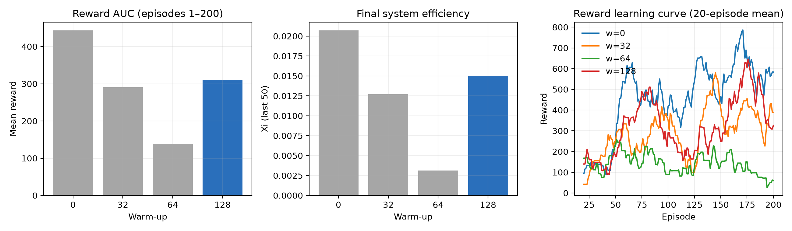

# 阶段 D：warm-up 门控报告

日期：2026-08-03

## 决策

后续实验冻结为 **Dyna-K=1、模型 warm-up=128 episodes**。这是 seed42、200 episodes
门控得到的工程选择，不是统计显著性结论；论文只能说明该配置由预先定义的门控规则选出，
不能声称 128 在总体上显著优于其他 warm-up。

## 统一比较

四个配置均使用 Case 1、`paper_xi`、K=1、seed42，并统一截取前 200 episodes。
warm-up=32 来自正式 K 消融中相同 seed 的前 200 轮，其余配置来自本轮门控。

| warm-up | Reward AUC 1–200 | 末50 Reward | 末50 Xi | 末50模型总损失 | 秒/episode |
|---:|---:|---:|---:|---:|---:|
| 0 | 443.54 | 621.59 | 0.02072 | 47.44 | 18.17 |
| 32 | 290.51 | 380.79 | 0.01271 | 42.77 | 19.20 |
| 64 | 138.04 | 94.10 | 0.00314 | 6.01 | 18.21 |
| 128 | 310.07 | 449.53 | 0.01500 | 5.76 | 18.15 |

相对 warm-up=32，warm-up=128：

- Reward AUC 提高 6.7%；
- 末 50 轮 Reward 提高 18.1%；
- 末 50 轮 Xi 提高 18.1%；
- 世界模型总损失降低约 86.5%；
- 单轮墙钟时间降低约 5.4%。

warm-up=0 的奖励与 Xi 最高，但在模型尚未积累可靠经验时立即使用虚拟规划，且末段模型
损失为四组最高。单 seed 高回报不足以排除由早期随机轨迹造成的偶然优势，因此不选择 0。
warm-up=64 同时出现 AUC 和末值退化，淘汰。

warm-up=128 在略优于 32 的样本效率下具有最低模型误差，并避免从未成熟模型规划，符合
Dyna-Q 的机制假设，因此作为风险更低的门控选择。

## 数据完整性与限制

- 三个新配置均完成 200/200 episodes，无异常、OOM 或提前退出；
- 四组碰撞率均为 0；
- 新配置每轮耗时约 18.2 秒，资源口径一致；
- 仅有一个 seed，不能计算有意义的总体显著性；
- 各配置训练轨迹从 warm-up 阈值后分叉，模型损失不能被解释为独立因果效应；
- 若论文把 warm-up 最优性作为主张，仍需配对 5-seed 验证；当前论文主线不依赖该主张。

原始门控结果：
`/mnt/UAV/results/dyna_ablation/dyna_ablation_20260803_113202.json`。
机器可读分析和逐配置指标位于
`results/stage_d_warmup_gate_20260803/`。

