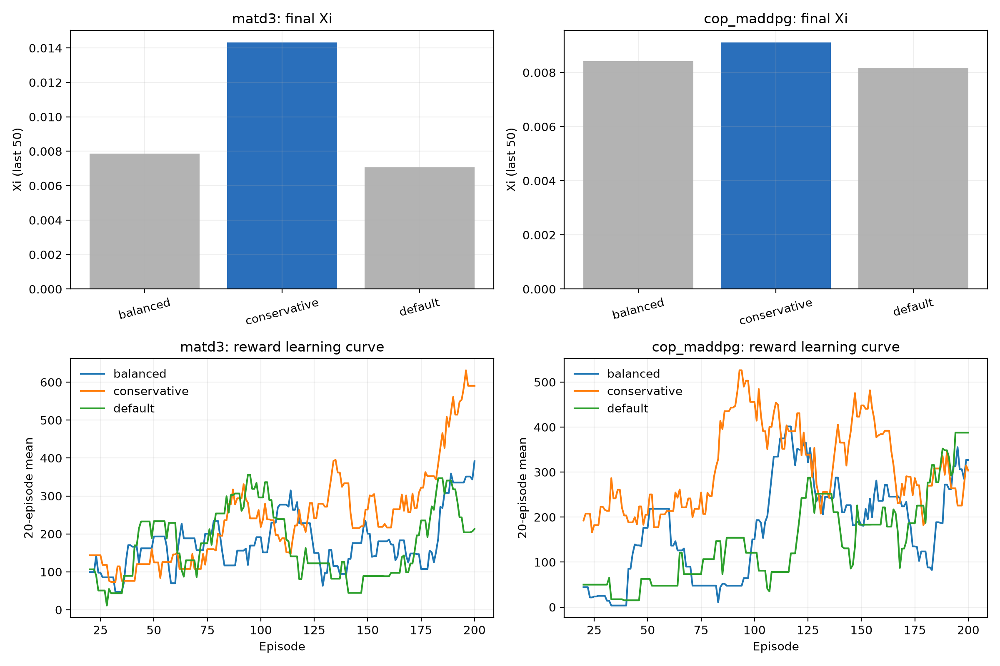

# 阶段 E：MATD3 与 CoP-MADDPG 参数门控报告

日期：2026-08-03

## 决策

对修复后的 MATD3 与 CoP-MADDPG 各运行 3 组超参数、seed42、200 episodes 的门控后，
**MATD3 保留 conservative（actor/critic lr=1e-4、target noise 0.1），CoP-MADDPG 保留
conservative（actor/critic/encoder lr=1e-4）**。这是单 seed 工程门控选择，不是统计
显著性结论；论文只能说明配置由预先定义的门控规则选出，不能声称 conservative 在总体
上显著优于其他配置。

## 门控结果

固定条件：Case 1、`paper_xi`、seed42、200 episodes、GPU1、3 并行 worker。
6/6 组均完整执行 `max_episodes=200`，无 NaN、无异常退出、无 CUDA OOM，碰撞事件均为 0。

### MATD3（每轮约 5.8 秒）

| 变体 | actor/critic lr | target noise | Reward AUC | 末50 Reward | 末50 Ξ | RBS交付/接收 | 总能耗 |
|---|---|---:|---:|---:|---:|---:|---:|
| default | 1e-3 / 1e-4 | 0.2 | 175.65 | 211.94 | 0.00706 | 128.2 / 240.4 | 18141.6 |
| balanced | 3e-4 / 3e-4 | 0.1 | 181.20 | 235.34 | 0.00785 | 142.3 / 303.6 | 18121.2 |
| **conservative** | 1e-4 / 1e-4 | 0.1 | **250.27** | **429.04** | **0.01431** | **259.5 / 480.2** | 18123.8 |

### CoP-MADDPG（每轮约 7.5 秒）

| 变体 | actor/critic/encoder lr | Reward AUC | 末50 Reward | 末50 Ξ | RBS交付/接收 | 总能耗 |
|---|---|---:|---:|---:|---:|---:|---:|
| default | 1e-3 / 1e-4 / 1e-4 | 146.70 | 245.35 | 0.00818 | 148.4 / 248.6 | 18144.2 |
| balanced | 3e-4 ×3 | 175.46 | 252.50 | 0.00842 | 152.7 / 325.9 | 18138.9 |
| **conservative** | 1e-4 ×3 | **298.97** | **273.15** | **0.00911** | **165.2 / 283.2** | 18143.7 |

## 解读

- 两种算法的 **conservative（lr=1e-4）都同时胜出**，是一个一致信号：低学习率在 200
  轮短程门控中更稳定、AUC 更高，且收益来自更高的 RBS 交付量，而不是 reward 缩放。
- MATD3 conservative 相对默认的末 50 轮 Ξ 提高约 102.6%、RBS 交付量提高约 102.4%，
  同时能耗几乎不变（−0.10%）。在默认配置下 MATD3 明显欠调（末 50 轮 Ξ 仅为
  0.00706），保守配置使它与论文核心基线处于可比较的量级。
- CoP conservative 相对默认的 AUC 提高约 103.8%、末 50 轮 Ξ 提高约 11.3%。CoP 的
  改进幅度小于 MATD3，说明 CoP 的性能瓶颈除学习率外可能仍与通信编码器有关，不把
  CoP 的收益解释为超越性的算法能力提升。
- balanced（3e-4）两种算法均落在 default 与 conservative 之间，无独立保留价值，淘汰。
- 全部 6 组碰撞事件为 0、能耗集中在 18121–18144，说明本轮比较没有通过增加能耗或
  碰撞来换取更高 reward；收益主要来自数据送达量提升（转发/接收比与接收量同时上升）。

## 数据、定义与实验范围

- 原始结果（服务器）：
  `/mnt/UAV/results/stage_e_gate/stage_e_gate_20260803_124733.json`；
- 原始文件 SHA-256：`5d7a4de64e60a9c8091659410b3b1daa`；
- 组合：MATD3/CoP × {default, balanced, conservative}、seed42、Case 1、`paper_xi`、
  200 episodes、GPU1、3 并行 worker；
- 门控清单与逐轮日志：
  `/root/Dyna-Q-DQN-UAV/logs/stage_e_gate_gpu1_20260803.log` 及各变体独立日志；
- 机器可读分析与图表：`results/stage_e_gate_20260803/`
  （`stage_e_gate_metrics_20260803.csv`、`stage_e_gate_analysis_20260803.json`）；
- 运行代码与服务器仓库一致：修复后的 `src/matd3_agent.py`、
  `src/cop_maddpg_agent.py` 在本地与服务器逐字节相同（md5 一致），服务器 HEAD
  `bd067e0`（阶段 D 冻结提交）+ 未提交的 Stage E 修复；
- 选择规则：完整运行（200 episodes、AUC 与 Ξ 均为有限值）中按 Reward AUC 取最高，
  Ξ 作为平局决断；两种算法各保留一个配置。

## 方法局限与稳健性说明

1. 只有 seed42 一个种子，是工程门控，不是显著性证据；任何"保守配置显著更好"的表述
   都不成立。
2. 200 轮远短于正式训练的早停长度（阶段 B 均值约 330–525 轮收敛），AUC 反映的是
   早期学习行为，可能低估高学习率配置的中期收益；这正是进入 5-seed 正式训练后再
   下结论的原因。
3. 修复后代码改变了两类算法的策略语义，本门控与修复前的历史结果不可合并，修复前
   结果仍标记为"不可用于公平算法能力比较"。
4. CoP 的改进幅度有限，若 5-seed 正式结果仍显著低于论文核心基线，应优先检查通信
   编码器收益是否可解释，而不是直接断言算法不适合该问题。

## 决策与后续步骤

**决策：MATD3 与 CoP-MADDPG 均采用 conservative 配置进入 5-seed 正式训练。** 门控
规则要求候选配置相对修复后默认配置表现稳定且相对论文核心基线具有继续比较的价值：
MATD3 conservative 使基线从明显欠调恢复到可比较量级，CoP conservative 在 AUC 上有
大幅改善且 Ξ 稳定改善，二者均满足进入正式训练的门槛。

后续按以下门控推进：

1. 冻结 conservative 配置，使用与阶段 B 相同的 5 个配对 seeds（42、123、2026、
   3407、8888）、同一早停规则（patience=1500、window=500）、Case 1、`paper_xi`；
2. 两种算法各 5 次运行，共 10 次，与阶段 B 核心三算法（MADDPG、NoDyna、DynaQ）
   在同一代码口径下比较；
3. 正式结果只用于回答"扩展基线经合理调参后是否仍显著弱于核心方法"，不得把单 seed
   门控写成论文结论；
4. 训练前记录 Git commit、参数、seed 与结果文件映射；训练运行期间不修改服务器
   `src/` 或 `scripts/` 代码；
5. 若 MATD3/CoP 正式训练仍远低于核心基线，且超参数空间已按计划收敛，则在论文中
   说明扩展基线不作为贬低性对比，主结论依赖核心三算法。

## 仍需回答的问题

- conservative 的早期优势在 5-seed 正式训练中是否保持，还是会劣化中期收敛？
- MATD3/CoP 经调参后是否仍与 MADDPG/NoDyna/DynaQ 存在可解释的差距？
- 修复后 CoP 通信编码器实际收到多少策略梯度，其收益能否用数据解释？
